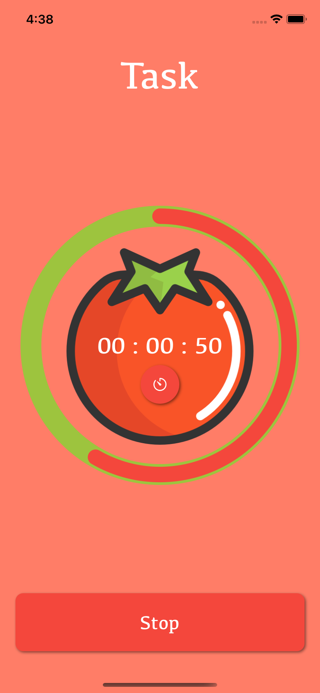
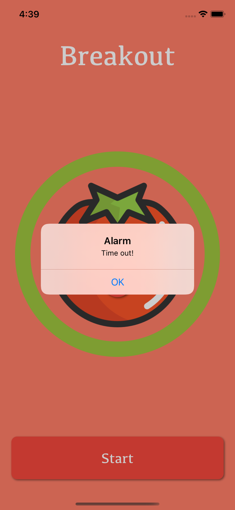
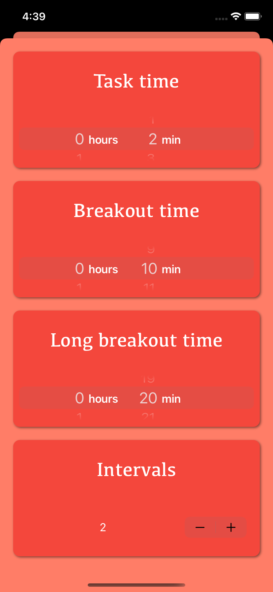

# Pomodoro-iOS-App

<p align="center"></p>

## Runtime environment
   

## Technologies
<a href="https://developer.apple.com/library/archive/documentation/Cocoa/Conceptual/ProgrammingWithObjectiveC/Introduction/Introduction.html">  </a>
<a href="https://developer.apple.com/support/xcode/">  </a>
<a href="https://cocoapods.org">  </a>


## Table of contents
* [General info](#general-info)
* [Functionality](#functionality)
* [How to build](#how-to-build)
* [Demo](#demo)
* [Sources](#sources)
* [Contact](#contact)

## General info

Simple pomodoro focus timer iOS app to quick start with Objective-C.

## Functionality

- three timer states: task, breakout, long breakout
- alarm with sound
- customisable times for task, breakout and long breakout
- customisable number of intervals

<p align="center"> 
		               
                    </p>

## How to build

In app main folder run this command:
```
pod install
```
After installing dependencies, you can run the project(`Pomodoro.xcworkspace`).

## Demo

<p align="center">  </p>

## Sources
- circular progress bar: https://github.com/MatiBot/MBCircularProgressBar

## Contact
<a href="https://www.linkedin.com/in/michał-nowak-53075a17a/">  </a>
<a href="https://twitter.com/mnowak061">  </a>
<a href="https://www.kaggle.com/mnowak061">  </a>
